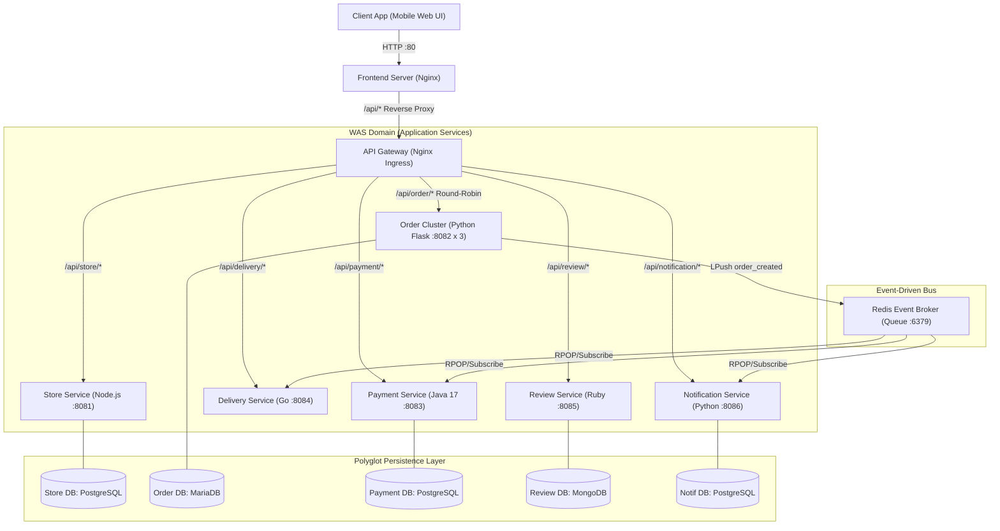
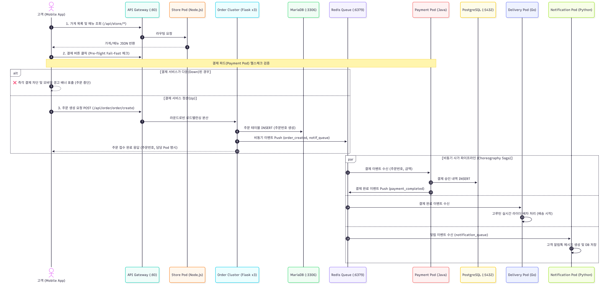
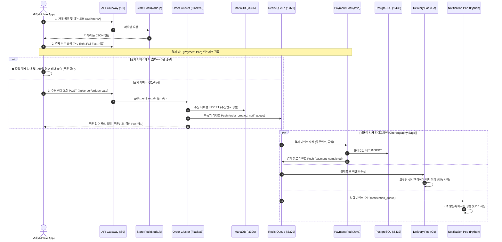

# Baemin Cloud Native Microservices Architecture (MSA)
> **Polyglot Runtimes, Database-per-Service, Event-Driven Choreography Saga & Fault-Tolerant System**

본 프로젝트는 대규모 배달 플랫폼(배달의민족)의 실전 마이크로서비스 아키텍처(MSA)를 컨테이너 가상화 기술로 완벽하게 구현한 엔터프라이즈 레퍼런스 시스템입니다. 

단순한 모놀리식 분할을 넘어, 각 도메인 특성에 최적화된 **5개 프로그래밍 언어(Node.js, Python, Java, Go, Ruby)**와 **도메인별 독립 격리 데이터베이스(PostgreSQL, MariaDB, MongoDB, Redis)**를 채택하고, **비동기 이벤트 기반 사가 패턴(Choreography Saga)**과 **즉각 실패(Fail-Fast) 트랜잭션 방어선**을 공존시켜 금융적 정합성과 시스템 가용성을 동시에 달성했습니다.

---

## 목차 (Table of Contents)

1. [시스템 아키텍처 개요](#1-시스템-아키텍처-개요)
2. [네트워크 및 인프라 토폴로지 (Network Topology)](#2-네트워크-및-인프라-토폴로지)
3. [16개 컨테이너 상세 명세](#3-16개-컨테이너-상세-명세)
4. [엔드투엔드 트래픽 및 비즈니스 시퀀스](#4-엔드투엔드-트래픽-및-비즈니스-시퀀스)
5. [폴리글랏 기술 스택 선정 근거 (Language & Database)](#5-폴리글랏-기술-스택-선정-근거)
   - [5.1 왜 각 서비스마다 다른 언어를 사용했는가?](#51-왜-각-서비스마다-다른-언어를-사용했는가)
   - [5.2 왜 서비스마다 전용 데이터베이스를 분리했는가? (Polyglot Persistence)](#52-왜-서비스마다-전용-데이터베이스를-분리했는가-polyglot-persistence)
6. [트랜잭션 설계 철학: Fail-Fast vs 비동기 사가(Choreography Saga)](#6-트랜잭션-설계-철학-fail-fast-vs-비동기-사가choreography-saga)
   - [6.1 왜 결제(Payment)는 비동기로 넘기지 않고 즉시 차단하는가?](#61-왜-결제payment는-비동기로-넘기지-않고-즉시-차단하는가)
   - [6.2 왜 배송(Delivery)과 알림(Notification)은 비동기 최종 일관성을 취하는가?](#62-왜-배송delivery과-알림notification은-비동기-최종-일관성을-취하는가)
7. [서비스별 코드 아키텍처 및 핵심 로직 분석](#7-서비스별-코드-아키텍처-및-핵심-로직-분석)
   - [7.1 API Gateway & Interactive Frontend](#71-api-gateway--interactive-frontend)
   - [7.2 Store Service (Node.js Express)](#72-store-service-nodejs-express)
   - [7.3 Order Service (Python Flask - 3 Replicas)](#73-order-service-python-flask---3-replicas)
   - [7.4 Payment Service (Java 17 Tomcat Servlet)](#74-payment-service-java-17-tomcat-servlet)
   - [7.5 Delivery Service (Go 1.22 Goroutines)](#75-delivery-service-go-122-goroutines)
   - [7.6 Review Service (Ruby 3.2 Sinatra)](#76-review-service-ruby-32-sinatra)
   - [7.7 Notification Service (Python 3.10 Background Worker)](#77-notification-service-python-310-background-worker)
8. [실행 방법 및 환경 구성](#8-실행-방법-및-환경-구성)
9. [장애 복원력(Fault Tolerance) 인터랙티브 실습 가이드](#9-장애-복원력fault-tolerance-인터랙티브-실습-가이드)

---

## 1. 시스템 아키텍처 개요

본 시스템은 클라이언트 단말기부터 인그레스 게이트웨이, 다중 도메인 마이크로서비스, 비동기 브로커, 독립 데이터 스토어까지 계층화된 엔터프라이즈 MSA 파이프라인을 따릅니다.


<details>
<summary>🔍 <b>Mermaid 아키텍처 다이어그램 코드 펼쳐보기</b></summary>



</details>

---

## 2. 네트워크 및 인프라 토폴로지

보안과 장애 격리를 위해 Docker 내부 브릿지 네트워크를 3단계 계층으로 분리 격리(Network Tier Isolation)했습니다.

| 네트워크 명 | 용도 및 격리 정책 | 소속 컨테이너 |
| :--- | :--- | :--- |
| **`dmz-net`** | 외부 인터넷과 맞닿는 공개 수신망. 외부 포트(80) 개방 | `frontend`, `api-gw` |
| **`was-net`** | 마이크로서비스 비즈니스 로직 및 메시지 브로커 전용 사설망 | `api-gw`, 6개 비즈니스 서비스, `redis-queue` |
| **`db-net`** | 데이터베이스 전용 내부 보안망. 외부 및 게이트웨이 직접 접근 차단 | 6개 비즈니스 서비스, 5개 데이터베이스 컨테이너 |

* **보안 격리 효과**: 외부 클라이언트는 `dmz-net`의 80 포트만을 통해서만 접근할 수 있으며, WAS 계층이나 데이터베이스 계층의 내부 IP나 포트(3306, 5432, 27017, 6379 등)에는 물리적으로 접근할 수 없습니다.
* **무중단 내부 라우팅**: 모든 서비스 간 통신은 Docker DNS 기반 서비스명(`http://baemin-order:8082`, `store-db:5432` 등)을 통해 이루어집니다.

---

## 3. 16개 컨테이너 상세 명세

시스템은 총 16개의 독립된 도커 컨테이너로 구성되어 유기적으로 동작합니다.

| 분류 | 서비스 명 | 컨테이너 명 | 런타임 / 베이스 이미지 | 포트 | 주요 역할 |
| :--- | :--- | :--- | :--- | :--- | :--- |
| **Edge** | `frontend` | `msa-frontend` | `nginx:alpine` | :80 (Host) | 배민 모바일 앱 UI 및 실시간 MSA 아키텍처 토폴로지 관제 화면 제공 |
| **Ingress** | `api-gw` | `msa-api-gw` | `nginx:alpine` | :80 (Internal) | 라우팅 역방향 프록시, CORS 처리, Order 파드 로드밸런싱 |
| **Core Service** | `baemin-store` | `msa-baemin-store-1` | Node.js 20 Express | :8081 | 가게 목록, 카테고리 필터링, 메뉴 상세 정보 서빙 |
| | `baemin-order` | `msa-baemin-order-1` | Python 3.11 Flask | :8082 | 주문서 접수, MariaDB 트랜잭션 기록, Redis 이벤트 발행 (Pod #1) |
| | `baemin-order` | `msa-baemin-order-2` | Python 3.11 Flask | :8082 | 주문 트래픽 분산 처리 (Pod #2) |
| | `baemin-order` | `msa-baemin-order-3` | Python 3.11 Flask | :8082 | 주문 트래픽 분산 처리 (Pod #3) |
| | `baemin-payment` | `msa-baemin-payment-1` | Java 17 Tomcat 10.1 | :8083 | 계좌/카드 결제 승인 원장 기록, 결제 검증 |
| | `baemin-delivery`| `msa-baemin-delivery-1`| Go 1.22 (Alpine CGO=0) | :8084 | 결제 완료 수신, 전담 라이더 자동 배차, 실시간 배송 추적 |
| | `baemin-review` | `msa-baemin-review-1` | Ruby 3.2 Sinatra | :8085 | 가게별 비정형 리뷰 작성, 별점 집계, MongoDB 도큐먼트 관리 |
| | `baemin-notification` | `msa-baemin-notification-1` | Python 3.10 Worker | :8086 | Redis 큐 감시(Consumer), 알림톡 발송 이력 보관 |
| **Message Broker**| `redis-queue` | `msa-redis-queue` | `redis:alpine` | :6379 | 비동기 이벤트 큐(`order_queue`, `payment_queue`, `notification_queue`) |
| **Persistence** | `store-db` | `msa-store-db` | PostgreSQL 15 | :5432 | 가게/메뉴 마스터 데이터 (RDBMS 정규화) |
| | `order-db` | `msa-order-db` | MariaDB LTS | :3306 | 대규모 주문 주문서 원장 (ACID 트랜잭션) |
| | `payment-db` | `msa-payment-db` | PostgreSQL 15 | :5432 | 금융 결제 승인 내역 및 트랜잭션 감사 원장 |
| | `review-db` | `msa-review-db` | MongoDB 6.0 | :27017 | BSON 도큐먼트 기반 동적 리뷰/피드 데이터 |
| | `notification-db`| `msa-notification-db`| PostgreSQL 15 | :5432 | 고객 알림 발송 이력 및 전송 성공 로그 |

---

## 4. 엔드투엔드 트래픽 및 비즈니스 시퀀스

사용자가 모바일 앱에서 주문 및 결제를 진행할 때 발생하는 전체 트랜잭션 흐름은 다음과 같습니다.



<details>
<summary>🔍 <b>Mermaid 시퀀스 다이어그램 코드 펼쳐보기</b></summary>



</details>

---

## 5. 폴리글랏 기술 스택 선정 근거

본 아키텍처는 **"모든 문제에 단 하나의 언어나 데이터베이스만 사용하는 황금 망치는 없다(No Silver Bullet)"**는 원칙에 입각하여 각 마이크로서비스 도메인의 특성에 가장 적합한 런타임과 DB를 채택했습니다.

### 5.1 왜 각 서비스마다 다른 언어를 사용했는가?

#### 1. Store Service ➔ Node.js 20 (Express)
* **도메인 특성**: 카테고리 필터링, 가게 정보, 메뉴 목록 등 **읽기 작업(Read-Heavy) 중심**의 단순 I/O 트래픽이 90% 이상을 차지합니다.
* **선정 이유**: Node.js의 싱글스레드 논블로킹 이벤트 루프(Event-driven I/O)는 정적 데이터 서빙 시 CPU 연산 오버헤드 없이 수천 건의 동시 읽기 연결을 매우 적은 메모리로 초고속 처리합니다. 또한 프론트엔드와의 JSON 객체 매핑 효율이 가장 뛰어납니다.

#### 2. Order Service ➔ Python 3.11 (Flask)
* **도메인 특성**: 장바구니 유효성 검증, 배달팁 계산, 주문 번호 규칙 생성, 비동기 큐 직렬화 등 **비즈니스 로직 변경이 가장 잦고 빠른 프로토타이핑이 필요한 도메인**입니다.
* **선정 이유**: 높은 코드 가독성과 간결한 구문으로 도메인 규칙을 신속하게 구현할 수 있습니다. 피크 타임 트래픽 폭증에 대비하여 Docker Compose 상에서 3개 파드로 손쉽게 수평 확장(Scale-out)할 수 있도록 상태를 갖지 않는(Stateless) 아키텍처로 설계되었습니다.

#### 3. Payment Service ➔ Java 17 (Apache Tomcat Servlet)
* **도메인 특성**: 계좌 출금, 카드 승인, 결제 원장 기록 등 **절대적인 정합성, 강타입 안정성, 트랜잭션 원자성(ACID)이 요구되는 금융 핵심 영역**입니다.
* **선정 이유**: 엔터프라이즈 금융권 표준 런타임인 JVM 기반의 엄격한 컴파일 타임 타입 검증과 JDBC 표준 트랜잭션 관리를 통해 데이터 오차를 원천 차단합니다. 메모리 누수 방지 및 고신뢰성 런타임을 제공합니다.

#### 4. Delivery Service ➔ Go 1.22 (Goroutines)
* **도메인 특성**: 수천 명의 라이더 위치 추적, 반경 기반 실시간 배차 매칭, 지연 없는 상태 동기화 등 **고성능 동시성(High Concurrency)과 초저지연 네트워킹이 필수적인 도메인**입니다.
* **선정 이유**: OS 스레드 대신 2KB 수준의 초경량 고루틴(Goroutine)을 채택하여 최소한의 메모리로 동시 수만 건의 배차 작업을 비동기 논블로킹으로 처리합니다. 컴파일된 네이티브 바이너리(Alpine 기반 15MB 이미지)로 기동 속도가 0.1초 미만입니다.

#### 5. Review Service ➔ Ruby 3.2 (Sinatra)
* **도메인 특성**: 사용자가 작성하는 리뷰 텍스트 파싱, 이모지 처리, 별점 집계 등 텍스트 중심의 CRUD 서비스입니다.
* **선정 이유**: Sinatra의 간결한 마이크로 프레임워크 문법과 루비 특유의 풍부한 문자열 처리 표현력을 활용하여 빠른 API 생산성을 제공하며, NoSQL(MongoDB) 도큐먼트와의 구조적 결합도가 우수합니다.

#### 6. Notification Service ➔ Python 3.10 (EDA Worker Loop)
* **도메인 특성**: 웹 요청 수신보다는 백그라운드에서 메시지 큐를 주기적으로 폴링/소비(Consumer)하여 외부 푸시나 알림톡을 발송하는 일꾼(Worker) 역할입니다.
* **선정 이유**: Redis 브로커 클라이언트 라이브러리와의 안정적인 연결 유지, JSON 역직렬화, 실패 시 재시도(Retry) 및 백오프 로직을 가장 적은 코드로 견고하게 유지할 수 있습니다.

---

### 5.2 왜 서비스마다 전용 데이터베이스를 분리했는가? (Polyglot Persistence)

마이크로서비스 아키텍처의 가장 중요한 철칙은 **"데이터베이스 공유 금지(Database-per-Service)"**입니다. 하나의 DB를 여러 서비스가 공유하면 테이블 스키마 변경 시 의존하는 모든 서비스가 장애를 겪게 됩니다.

```
[Store-Service]  --> [PostgreSQL (store-db)]       : 정규화된 마스터 카탈로그
[Order-Service]  --> [MariaDB (order-db)]          : 대량 쓰기 트랜잭션 원장
[Payment-Service]--> [PostgreSQL (payment-db)]     : 엄격한 금융 원장 & 감사 로그
[Review-Service] --> [MongoDB (review-db)]         : 유연한 비정형 도큐먼트
[Notif-Service]  --> [PostgreSQL (notification-db)]: 알림 발송 이력 저장소
[Message Bus]    --> [Redis (redis-queue)]         : 초저지연 인메모리 큐
```

| 데이터베이스 | 담당 서비스 | 엔진 특성 및 채택 이유 |
| :--- | :--- | :--- |
| **PostgreSQL 15** | Store Service | 카테고리-가게-메뉴 간의 1:N 복합 릴레이션 및 인덱싱 쿼리 최적화 |
| **MariaDB (MySQL)** | Order Service | 이커머스 표준 쓰기 최적화 엔진(InnoDB). 대규모 주문 트랜잭션의 빠른 INSERT 처리 |
| **PostgreSQL 15** | Payment Service | 엄격한 제약조건(Constraints)과 데이터 무결성 보장, 금융 감사 로그의 안전한 보관 |
| **MongoDB 6.0** | Review Service | BSON 기반 NoSQL. 사용자에 따라 사진, 태그, 별점 구조가 달라지는 비정형 리뷰 데이터를 스키마 변경 비용 없이 유연하게 적재 |
| **PostgreSQL 15** | Notification Service | 고객별 수신 이력 및 전송 성공 여부를 안정적으로 관리하는 관계형 로깅 |
| **Redis Alpine** | 메시지 버스 전용 | 디스크 I/O 없이 메모리 상에서 초당 수만 건의 비동기 이벤트를 큐잉(`LPUSH`/`RPOP`)하는 초경량 브로커 |

---

## 6. 트랜잭션 설계 철학: Fail-Fast vs 비동기 사가(Choreography Saga)

본 시스템은 **"모든 것을 무조건 비동기로 처리하지 않는다"**는 실무 아키텍처 원칙을 적용했습니다. 도메인의 비즈니스 성격에 따라 트랜잭션 전략을 명확하게 이원화했습니다.

### 6.1 왜 결제(Payment)는 비동기로 넘기지 않고 즉시 차단하는가?

> **"카드 한도 조회도 안 되는데 배달 음식을 조리하고 배송 기사를 부를 수는 없다."**

* **금융적 리스크 방지**:
  * 만약 결제 서비스가 다운되었는데도 주문을 비동기 큐에 집어넣고 통과시켜버리면, 사용자의 카드 한도 초과나 계좌 잔액 부족 여부를 알 수 없는 상태에서 라이더 배차 및 음식점 조리가 시작됩니다.
  * 이는 곧 **무전취식 및 정산 불능(미수금)**이라는 치명적인 금융 사고로 직결됩니다.
* **Fail-Fast 사전 검증(Pre-Flight Check)**:
  * 주문 제출 직전, 결제 서비스 파드(`baemin-payment`)의 헬스체크 상태를 동기식으로 확인합니다.
  * 결제 서비스가 응답하지 않거나 점검 중일 경우, 주문을 큐에 넣지 않고 **클라이언트 주문서 화면에서 즉각 결제를 차단**하며 현실적인 모바일 경고 알림(`결제 승인 실패: 결제 파드 점검 중`)을 표출합니다.
  * 결과적으로, 결제가 불가능한 주문은 아예 시스템에 유입되지 않아 데이터 왜곡을 방지합니다.

### 6.2 왜 배송(Delivery)과 알림(Notification)은 비동기 최종 일관성을 취하는가?

> **"결제가 끝났다면, 카카오 알림톡 서버가 잠시 죽어있어도 주문과 조리는 계속되어야 한다."**

* **장애 전파 격리 (Fault Isolation)**:
  * 알림 서비스나 배송 서비스 같은 부가 파이프라인의 일시적 장애가 고객의 핵심 결제 프로세스까지 물고 늘어져 롤백시키는 현상을 방지합니다.
* **최종 일관성 (Eventual Consistency)**:
  * 결제가 정상 승인된 주문 이벤트는 Redis의 `notification_queue`와 배송 이벤트 큐에 안전하게 적재됩니다.
  * 알림 파드가 죽어있는 동안에도 메시지는 손실되지 않고 큐에 보관됩니다.
  * 추후 알림 파드가 복구(Revive)되거나 컨테이너가 다시 올라오는 즉시, 백그라운드 워커가 큐에 대기 중이던 알림 이벤트를 자동으로 꺼내어(Consume) 발송을 완수합니다.

---

## 7. 서비스별 코드 아키텍처 및 핵심 로직 분석

### 7.1 API Gateway & Interactive Frontend
* **API Gateway 설정**: [`api-gw/default.conf`](file:///C:/Users/User/Desktop/workspace/msa/api-gw/default.conf)
  * Nginx 리버스 프록시를 통해 `/api/store/*`, `/api/order/*`, `/api/payment/*` 등의 경로를 각 내부 컨테이너 포트로 투명하게 라우팅합니다.
  * 특히 `upstream order_servers` 설정을 통해 3대의 `baemin-order` 파드로 트래픽을 고르게 분산(Round-Robin)합니다.
* **인터랙티브 웹 프론트엔드**: [`frontend/index.html`](file:///C:/Users/User/Desktop/workspace/msa/frontend/index.html)
  * **모바일 폰 뷰**: 실제 배민 앱과 동일한 상단 노치, 주소지 바, 카테고리 필터, 위시리스트(찜 탭), 장바구니, 결제 수단 선택, 주문 배달 트래킹, 알림 센터 모달을 제공합니다.
  * **모바일 푸시 배너**: 브라우저의 기본 `alert()` 대신, 스마트폰 상단 노치 아래로 스르륵 내려오는 실시간 푸시 알림 UI(`showMobilePush`)를 탑재했습니다.
  * **실시간 아키텍처 토폴로지 관제**: 우측 화면에 16개 컨테이너의 노드 배치, 헬스 상태 LED(초록/빨강), 동적 트래픽 플로우 선(SVG Line)을 실시간으로 시각화합니다. 노드를 클릭하여 강제로 프로세스를 종료(Kill)하거나 복구(Revive)하는 장애 주입 인터랙션을 지원합니다.

### 7.2 Store Service (Node.js Express)
* **소스 코드**: [`baemin-store-service/server.js`](file:///C:/Users/User/Desktop/workspace/msa/baemin-store-service/server.js)
* **핵심 로직**:
  * PostgreSQL 커넥션 풀(`pg.Pool`)을 생성하고 테이블 자동 생성 및 초기 시드 데이터(가게 4곳, 각 메뉴 3개)를 주입합니다.
  * `GET /store/stores`: 전체 가게 목록 조회 및 메뉴 수 조인 쿼리.
  * `GET /store/store/:id`: 특정 가게 상세 정보 및 메뉴 배열 JSON 응답.
  * `GET /health`: 서비스 생존 여부 헬스체크 엔드포인트.

### 7.3 Order Service (Python Flask - 3 Replicas)
* **소스 코드**: [`baemin-order-service/app.py`](file:///C:/Users/User/Desktop/workspace/msa/baemin-order-service/app.py)
* **핵심 로직**:
  * MariaDB 연결 및 `orders` 테이블 생성.
  * `POST /order/create`: 
    * 고유 주문번호(`BM-타임스탬프-난수`) 발급.
    * MariaDB에 주문 내역 INSERT.
    * Redis 비동기 큐(`order_queue`, `notification_queue`)에 `json.dumps(event)`를 `lpush`로 발행.
    * 응답 헤더 및 바디에 현재 요청을 처리한 Pod 식별자(`os.uname().nodename`)를 반환하여 로드밸런싱을 시각적으로 증명.

### 7.4 Payment Service (Java 17 Tomcat Servlet)
* **소스 코드**: [`baemin-payment-service/src/PaymentServlet.java`](file:///C:/Users/User/Desktop/workspace/msa/baemin-payment-service/src/PaymentServlet.java)
* **핵심 로직**:
  * 서블릿 라이프사이클 `init()`에서 PostgreSQL `payments` 테이블을 DDL로 검증.
  * `doPost()`: 주문서의 결제 요청을 수신하여 결제 고유번호(`PAY-UUID`) 발급, 거래 금액 및 수단 검증 후 PostgreSQL 원장에 트랜잭션 기록.
  * `doGet()`: 헬스체크 및 결제 승인 내역 조회 서빙.

### 7.5 Delivery Service (Go 1.22 Goroutines)
* **소스 코드**: [`baemin-delivery-service/main.go`](file:///C:/Users/User/Desktop/workspace/msa/baemin-delivery-service/main.go)
* **핵심 로직**:
  * Go의 고루틴(`go watchPaymentEvents()`)을 백그라운드로 실행하여 Redis 큐를 비동기 감시.
  * 결제 완료 이벤트가 감지되면 즉시 전담 라이더(배민 라이더스)를 가상 배차하고 배달 완료 예상 시간 계산.
  * `GET /delivery/track`: 현재 배송 상태(배차 완료, 픽업 완료, 배달 중)를 JSON으로 클라이언트에 스트리밍.

### 7.6 Review Service (Ruby 3.2 Sinatra)
* **소스 코드**: [`baemin-review-service/app.rb`](file:///C:/Users/User/Desktop/workspace/msa/baemin-review-service/app.rb)
* **핵심 로직**:
  * `mongo` Gem을 통해 MongoDB `reviews` 컬렉션에 연결.
  * `POST /review/create`: 작성자, 별점, 리뷰 본문을 BSON 도큐먼트로 MongoDB에 삽입.
  * `GET /review/store/:id`: 해당 가게의 모든 리뷰 목록 반환 및 평균 별점 집계.

### 7.7 Notification Service (Python 3.10 Background Worker)
* **소스 코드**: [`baemin-notification-service/app.py`](file:///C:/Users/User/Desktop/workspace/msa/baemin-notification-service/app.py)
* **핵심 로직**:
  * 별도 스레드에서 `redis.rpop("notification_queue")` 무한 루프를 돌며 대기 중인 알림 이벤트 수신.
  * 수신된 이벤트를 바탕으로 알림톡 템플릿 생성 후 PostgreSQL `notifications` 테이블에 저장.
  * 서비스가 다운되었다가 다시 살아나면 큐에 쌓여있던 과거 메시지들을 순차적으로 일괄 소비(Bulk Drain)하여 복원.

---

## 8. 실행 방법 및 환경 구성

### 8.1 사전 요구사항
* Docker Desktop (Windows / macOS / Linux)
* Docker Compose v2.0 이상

### 8.2 컨테이너 빌드 및 실행

프로젝트 루트 경로(`C:\Users\User\Desktop\workspace\msa`)의 터미널에서 다음 명령어를 실행합니다.

```powershell
# 주문 서비스 3개 파드 스케일아웃을 포함한 전체 16개 컨테이너 백그라운드 빌드 및 기동
docker-compose up -d --build --scale baemin-order=3
```

### 8.3 접속 및 모니터링
* **웹 브라우저 접속**: `http://localhost` (또는 `http://127.0.0.1`)
* **컨테이너 상태 확인**:
  ```powershell
  docker-compose ps
  ```

---

## 9. 장애 복원력(Fault Tolerance) 인터랙티브 실습 가이드

우측 아키텍처 토폴로지 맵을 통해 MSA의 핵심 가치인 장애 격리와 복원력을 직접 검증할 수 있습니다.

### 시나리오 1. 결제 파드 다운 시 Fail-Fast 방어선 검증
1. 우측 맵에서 `Payment Pod (:8083)` 노드를 클릭하여 강제 종료(Kill)합니다. (LED 빨간색 전환)
2. 모바일 화면에서 메뉴를 담고 **결제하기** 버튼을 누릅니다.
3. **결과**: 결제가 진행되지 않고 즉각 차단되며, 모바일 상단에 `[결제 승인 실패] 결제 파드가 오프라인 상태입니다.` 푸시 배너가 뜹니다.
4. 주문서 화면에 머무르며 결제되지 않은 잘못된 주문이 생성되지 않습니다.
5. `Payment Pod`를 다시 클릭하여 복구(Revive)한 뒤 결제하면 즉시 정상 접수됩니다.

### 시나리오 2. 알림 파드 다운 시 비동기 큐 버퍼링 및 최종 일관성 검증
1. 우측 맵에서 `Notification Pod (:8086)` 노드를 클릭하여 강제 종료합니다.
2. 모바일 화면에서 주문 및 결제를 정상 진행합니다.
3. **결과**: 알림 파드가 죽어있어도 결제와 라이더 배차는 성공적으로 완료됩니다.
4. 알림 이벤트는 Redis의 `notification_queue`에 안전하게 대기 상태로 보관됩니다.
5. 우측 맵에서 `Notification Pod`를 다시 클릭하여 복구합니다.
6. **결과**: 알림 파드가 기동되자마자 큐에 대기 중이던 알림 이벤트를 자동으로 소비(Consume)하여 알림 센터에 종 모양 배지가 갱신되고 알림톡이 정상 등록됩니다.

### 시나리오 3. 주문 서비스 로드밸런싱 검증
1. 연속으로 주문을 3~4회 생성합니다.
2. 주문 완료 안내 및 중앙 이벤트 로그 콘솔을 확인합니다.
3. **결과**: `[처리서버 Pod: baemin-order-1]`, `[처리서버 Pod: baemin-order-2]`, `[처리서버 Pod: baemin-order-3]`가 번갈아가며 요청을 처리하는 것을 확인할 수 있습니다.

### 시나리오 4. 공장 초기화 (Factory Reset)
* 화면 우측 상단의 **[↺ 전체 DB 초기화]** 버튼을 클릭하면, 5개 데이터베이스의 테이블과 Redis 메시지 큐가 도커 처음 실행 시점의 깨끗한 시드 상태로 100% 자동 리셋됩니다.
